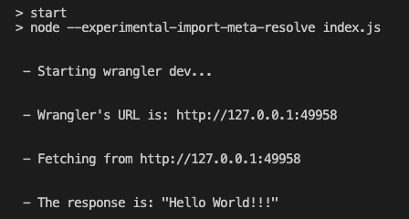
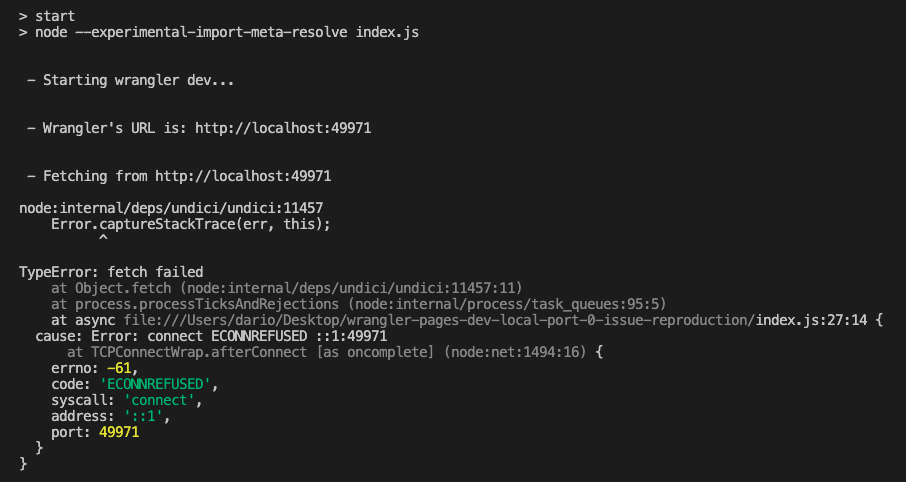

# wrangler dev local port=0 issue reproduction

> [!NOTE]
> This only happens with node 18 and older, from node 20 onward the issue doesn't seem to appear

To reproduce the issue, see that the following works fine (using `wrangler@3.17.0`):
```
npm i
```

```
npm start
```

producing the following result:



If we instead switch to `wrangler@3.18.0`:
```diff
  "devDependencies": {
-    "wrangler": "3.17.0"
+    "wrangler": "3.18.0"
  }
```

and

```
npm i
```

```
npm start
```

we get the following result:



Another way to avoid getting the `ECONNREFUSED` error (while using the latest wrangler versions) is to not specify port 0
for the `wrangler dev` command:
```diff
-        ["dev", "--port=0"],
+        ["dev"],
```
or specifying a valid non-zero port:
```diff
-        ["dev", "--port=0"],
+        ["dev", "--port=9889"],
```
